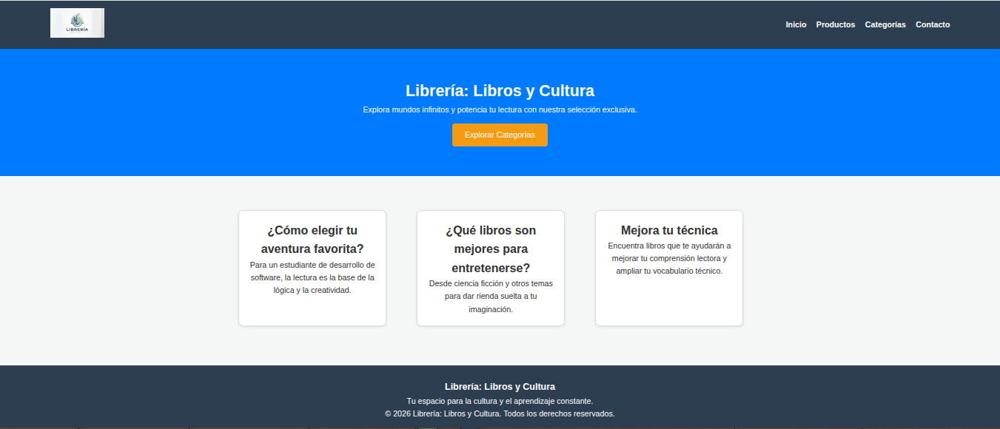
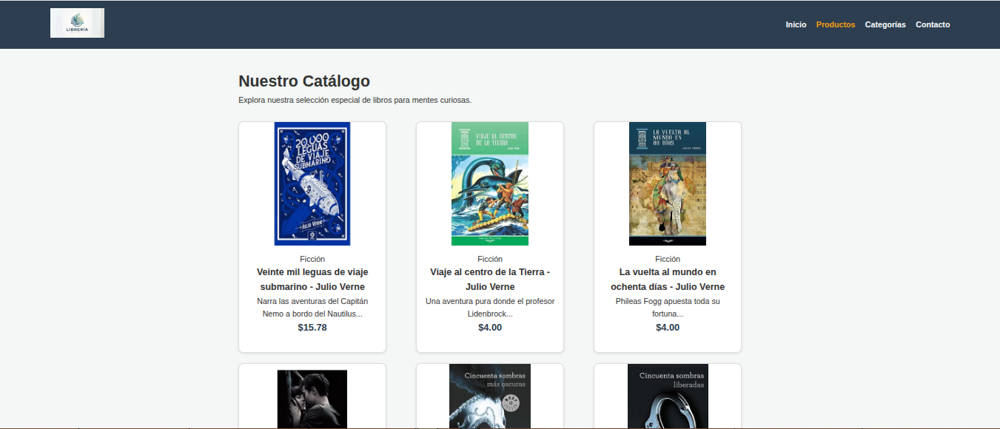
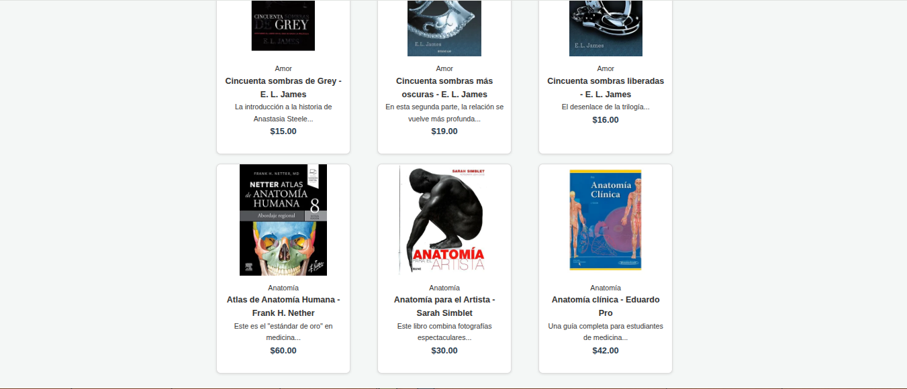
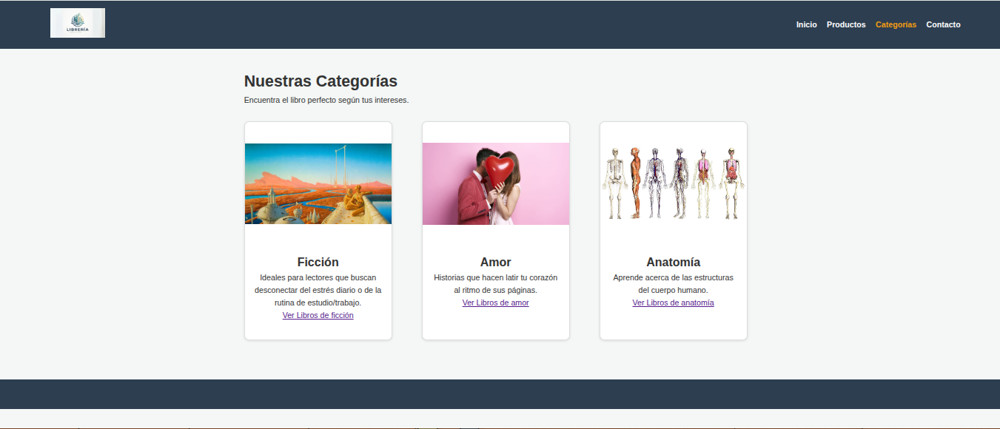
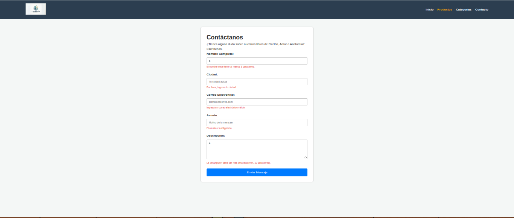
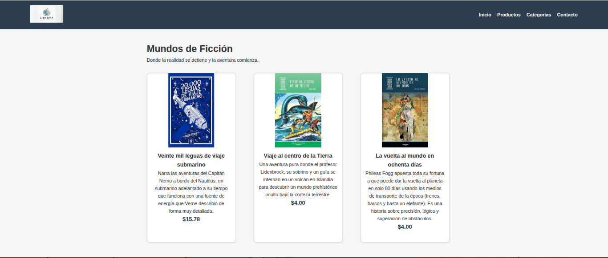
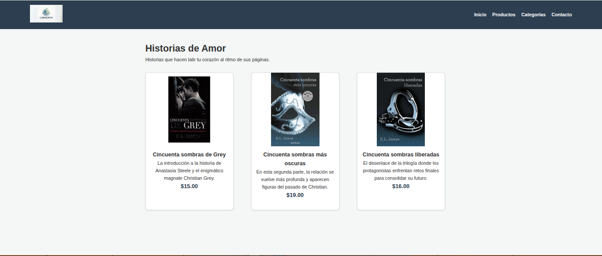
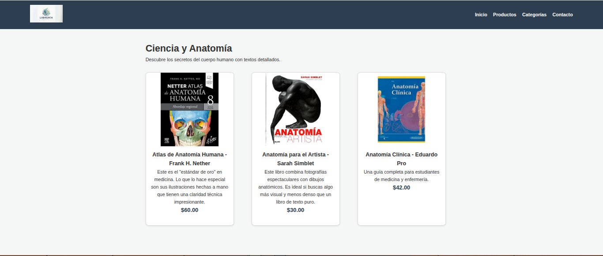

Datos para comprender la estructura del proyecto final.

1. Nombre del proyecto: Librería: Libros y Cultura.

2. Integrantes: Jorge Rueda, Carlos Lopez.

3. Temática elegida: Librería de ficción, amor y anatomía.

4. Descripción del proyecto: Esta es una página web diseñada para una librería online, desarrollada como parte de nuestro proyecto práctico en la materia de Desarrollo Web de la carrera de Desarrollo de Software. El objetivo principal del sitio es ofrecer una interfaz intuitiva y atractiva para que los usuarios puedan explorar un catálogo de libros, segmentados por categorías, y gestionar sus selecciones.

5. Capturas de pantalla:

6. Enlace al sitio desplegado en GitHub Pages
